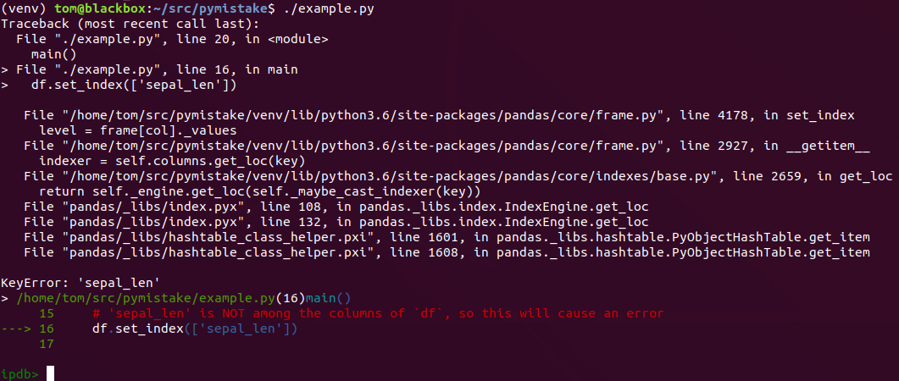
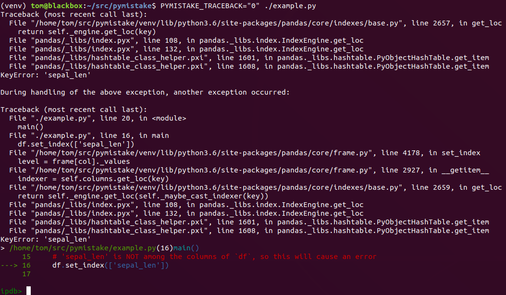

## What does `pymistake` do?

`pymistake` makes developing/debugging data analysis scripts easier, by
modifying the behavior of your `python` interpreter in two ways:
1. Automatically starts a postmortem debugger (`ipdb` or `pdb`) for any
   unanticipated errors that happen in your code, to allow inspection of
   variables right before the crash. This can be useful if you would otherwise 
   want to start a debugger near the offending line anyway, but would have to
   re-run some potentially time consuming analysis code to get back to the
   offending portion.

   To see the commands available in your debugger, type `h` in the interactive
   shell that pops up when there is an uncaught exception, and press `<Ctrl>-D`
   to exit the debugger.

2. Modifies the default traceback format to highlight the last line in any of a
   set of designed source directories, which should have source for the projects
   you are working on. Only files under these directories should have their line
   highlighted with `pymistake`'s modified traceback.

   See the "Examples" below for how this can be useful.

Errors of the type `SyntaxError` are not handled any differently, as generally
you would not want either a debugger or a modified traceback for these, because
they are generally in your code and happen immediately.

If you have `ipdb` installed, the debugger will move "up" a number of frames
until it is in a frame originating in one of your source code files. This
feature is to expedite debugging around the point of the crash, as generally
interaction with objects created in your code is more useful than starting the
debugger deep in the calls of some library. These moves "up" are equivalent to
manually entering the `u` command in the debugger. As I have not figured out how
to silence the lines `ipdb` prints after each command, there will be a set of
`ipdb` prompt lines for each of these moves up, in addition to the first set
of lines when the postmortem debugger was started.


### Examples

These examples were generated using the `example.py` in this script, which also
requires `pandas`. I had `ipdb` installed for the Python I used to generate
these examples.


In the above image, note the `>` character to the left of one of the pairs of
lines in the traceback. `pymistake` will try to add this prefix to the last
section of the traceback that refers to code you are developing, as well as a
blank line following this section. These modifications are to make it more
visually apparent where the offending part of *your* code is, as that's the code
you most likely need to fix.

Again in the image above, also note the two debugger prompts. There are two
prompts, rather than one, because the debugger moved "up" one frame, as
described in the previous section.


In the above image, both the custom traceback formatting and the automatic
postmortem debugger are disabled. This output should be exactly what you would
get without `pymistake` installed.


In the above image, the postmortem debugger is disabled, but the custom
traceback formatting is still active.



In the above image, the custom traceback is disabled, but the automatic
postmortem debugging of uncaught errors is enabled. One thing to note in this
example is that the debugger did not move "up" one frame like in the first
example . This is because a dependence of the code that counts how many frames
to move up on the custom traceback printing code. I could potentially remove
this limitation in the future, but for now, if you want to automatically move up
into a frame from your code, you need to enable the custom traceback printing.


## Installation

Put these scripts in a directory on `PYTHONPATH` to get better stack traces.

If you don't know how to do the above, I'll explain. First, clone this repo:
```
cd ~/src # or other directory where you keep all of your data analysis git repos
git clone git://github.com/tom-f-oconnell/pymistake
```

Then, if you are using a `bash` shell, you can add these scripts to your
`PYTHONPATH` by opening your `~/.bashrc` in a text editor, and adding these
lines:
```
# If you have some section in your ~/.bashrc that was put there by `conda`,
# it'd be slightly safer to put these lines after that section.

# Replace this with where you cloned it to, if different.
PYMISTAKE_PATH=$HOME/src/pymistake

if [ -d $PYMISTAKE_PATH ]; then
  export PYTHONPATH="${PYTHONPATH}:${PYMISTAKE_PATH}"
  # Here you may want to set environment variables configuring
  # `pymistake`. See the "Configuration" section below.
fi
```

For other shells / places you run `python`, look up instructions for how add
directories to the `PYTHONPATH` in those environments.


## Configuration

`pymistake` can be configured through environment variables. The available
settings are:
- `PYMISTAKE_DISABLE` default: `"0"`
   options: `"1"` enabled, `"0"` disabled

   If enabled, this disables *all* features of `pymistake`. This is to quickly
   test if some weirdness in a program is the fault of `pymistake`. For example,
   you should be able to disable `pymistake` just for one run of a script like
   this:
   ```
   PYMISTAKE_DISABLE="1" python <your-script>.py
   ```

- `PYMISTAKE_DEBUG_UNCAUGHT` default: `"1"`
   options: `"1"` enabled, `"0"` disabled

   Set this to `"1"` if you want the modified tracebacks `pymistake` provides,
   without the automatic postmortem debugging of (most) uncaught exceptions.

- `PYMISTAKE_TRACEBACK` default: `"1"`
   options: `"1"` enabled, `"0"` disabled

   Set this to `"0"` if you want your Python's usual traceback formatting, but
   perhaps still want to use the automatic postmortem debugging.

- `PYMISTAKE_DEV_DIRS` default: `[os.path.expanduser('~')]`
   options: any list of absolute paths, ':' separated.
   '~' is acceptable in paths.

   Except if a directory also is under a blacklisted directory (see 
   `PYMISTAKE_NON_DEV_DIRS`), Python files under these "dev" directories
   will be highlighted in the modified traceback.

- `PYMISTAKE_NON_DEV_DIRS` default: `['site-packages', 'dist-packages']`
  options: a list of paths as `PYMISTAKE_DEV_DIRS` above.

  Although by default, any Python file under your home directory will be 
  highlighted in the modified tracebacks, files under these directories are
  excluded. The default value for this variable should exclude user / virtual
  environment installed Python files that also happen to be under your home
  folder.

There are currently many options to configure for the custom exception printing,
but I have not made this configuration available through environment variables
yet. If you would like to change the look of the modified tracebacks, see the
keyword arguments to the `format_exception` function in `excepthook.py`. You can
either change the defaults for these arguments or pass particular values in the 
call to `format_exception` in the `print_exception` definition (in the same
file).


## Possible problems `pymistake` could cause

Both causing uncaught errors to trigger a debugger and modifying traceback
output have high potential to cause strange errors in programs that depend on
your system `python`. To try to avoid changing the behavior of any of these
programs, `pymistake` tries to determine whether code is being run
interactively, and only becomes enabled when it detects that. See the 
`script_is_attended()` function defined in `util.py` for details on how an
interactive session is detected.

I aimed to make this work in any python above a modern release of `python2.7`,
including any `python3`, but there may be certain pythons where `pymistake` has
unexpected behavior.

I also aim to support both `pdb` (the standard library debugger) and `ipdb`
(which needs to be installed separately), for the postmortem debugging, but have
mainly tested this myself with `ipdb`. Please make a Github issue if any of the 
support for `pdb` does not appear to work for you.


## Virtual Environments

As it's currently implemented, `pymistake` will not work for any Python where:
```
import site
print(site.ENABLE_USER_SITE)
```
...prints `False`. It seems that virtual environments created without the 
`--system-site-packages` flag will have `site.ENABLE_USER_SITE == False`, and
thus will *not* work.

It may be possible to implement use `.pth` files 
[like this](https://stackoverflow.com/questions/40484942), to extend support to
virtual environments created without the `--system-site-packages` flag.


## pypi

If there is enough interest in this project, I can try to package this repo for 
PyPi, but may not otherwise put in the work.

